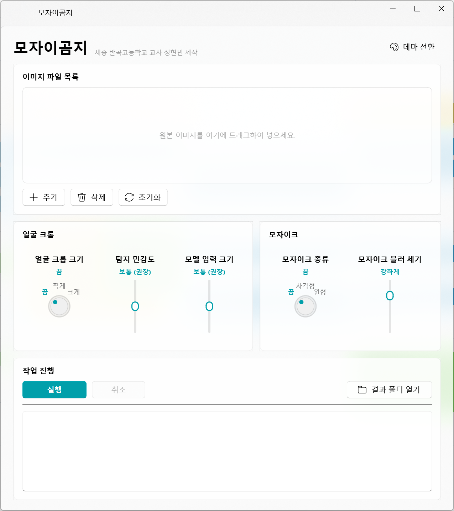
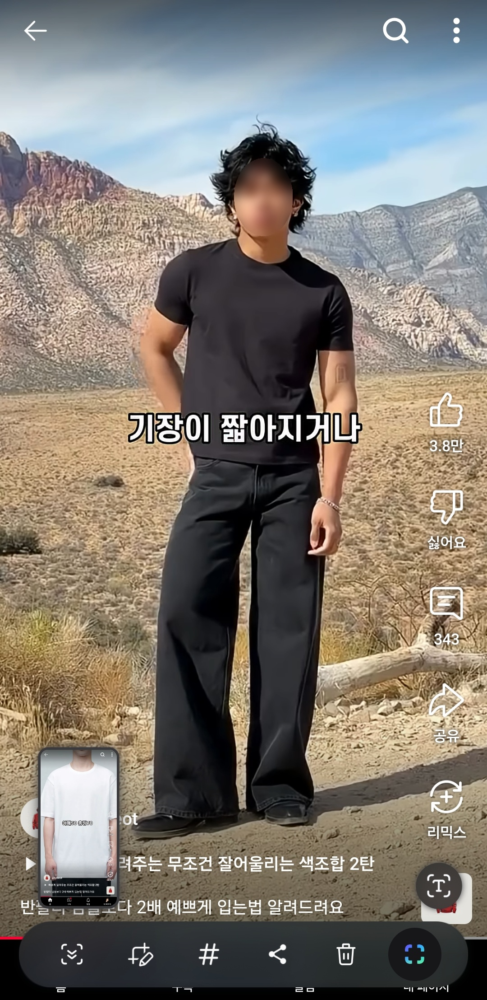

# 강사 소개

<div class="mt-8 text-lg opacity-70">세종 반곡고등학교 교사</div>

<div class="text-4xl font-medium mt-2">정현민</div>

::right::

<div class="pt-28 pl-6 opacity-80 leading-loose">

전 융합정보부장

전 교육과정부장

현 1학년 8반 담임 교사

</div>

---
layout: center
---

# 주요 이력

## <span class="year">2021</span> · 세종 중등교육과 파견

(가칭)창의진로교육원(현 세종진로교육원) 전시체험공간 설계

<div class="mt-6 text-sm opacity-40">[이미지 예정] 창의진로교육원 스케치업 모델링 ↔ 현재 구축 모습 비교</div>

<!--
원래 공학적인 부분에 관심 많음.
-->

---
layout: center
---

# 주요 이력

## <span class="year">2022</span> · 안전체험교육원 파견

안전체험교육원 안전체험공간 재구축 설계

<!--
이때쯤 ChatGPT 3.5 베타 버전이 나왔던 걸로 기억. 협상에 의한 계약 사업계획서 초안 작성에 들어갔는데, 신기하기는 했으나 인간 수준의 작문 능력에는 한참 미치지 못 했음. 그래서 본격적으로 활용하지는 않았음. 연말 정도 되니 ChatGPT가 꽤 알려졌지만, 아직 교육계에서 쓰는 사람은 극 소수였던 기억.
-->

---
layout: center
---

# 주요 이력

## <span class="year">2023</span> · 반곡고등학교 정보부장

<!--
파견 복귀 후, 보고서 좀 잘 쓴다면서?라는 소문이 나서 간택됐음. 담임 교사가 하고 싶었는데, 정보부장으로 강제 배정되었고, 디지털 선도학교를 2년 동안 이끌었음.
이 시기에는 아직 교사들에게 ChatGPT의 존재가 알려지지 않았던 걸로 기억. 그래서 생활기록부 작성 초안을 잡을 때 혼자 잘 써먹었고, 2024년 초입 정도가 되니까 연수가 생겨나기 시작했음.
-->

---
layout: center
---

# 주요 이력

파견 복귀 후 '문과도 할 수 있는 코딩' 방과후학교

<div class="mt-4 opacity-70">이후 '바이브 코딩'이라고 부른다는 걸 알게 됨</div>

---
layout: two-cols
class: my-auto
---

# 1. 모자이곰지

<div class="mt-4 opacity-80">보고서 쓸 때, 학생 초상권을 지켜달래서 만들었습니다.</div>


```text
github.com/bebegomzi/mozaigomzi
```

::right::



<!--
디지털 선도학교 보고서 작성 필요.
연말에 보고서 작성할 때 학생 얼굴 모자이크해서 보내주라고 하는데, 모자이크는 어떻게 하는데?
학생 얼굴 안 나오게 찍거나, 포토샵으로 하세요. 근데 포토샵을 안 사주는데?
-->

---
class: text-center
---

# 얼굴만 가리거나, 얼굴만 남기거나

<div class="flex items-end justify-center gap-6 mt-10">
  <figure class="m-0">
    
    <figcaption class="text-sm opacity-60 mt-3">원본</figcaption>
  </figure>
  <div class="text-4xl opacity-30 pb-12">→</div>
  <figure class="m-0">
    
    <figcaption class="text-sm opacity-60 mt-3">얼굴 모자이크</figcaption>
  </figure>
  <figure class="m-0">
    
    <figcaption class="text-sm opacity-60 mt-3">얼굴만 크롭</figcaption>
  </figure>
</div>

---
layout: center
---

# 3. School_pdf

<!--
세종은 개인정보 첨부파일을 암호를 걸어서 업로드하게 하고 있음.
hwp, 엑셀도 번거로운데, 문제는 PDF 파일. 암호를 걸고 해제할 수 있는 프로그램을 보급을 안 해줬음. 암호 걸겠다고 알PDF 설치하는 건 광고 때문에 싫고, 기본앱인 edge나 chrome은 암호가 안 걸림.
한PDF로 가능하기는 한데, 바로 거는 게 아니고 "다른 이름으로 저장"해서 암호 걸고, 기존 파일 삭제하고...
~라는 내용을 교무실에 다른 선생님이 하고 있길래, 30분 동안 만들어서 보내줌.
-->

---
layout: center
---

# 4. 성취평가 웹앱

<div class="mt-6 text-sm opacity-50">https://bebegomzi-achievement-analysis.hf.space/</div>

<div class="mt-2 text-sm opacity-40">[메모] 평가 분석·환류 보고서·학기말 시뮬레이터</div>

---
layout: image-right
image: /curriculum_parser.png
class: my-auto
---

# 5. 교육과정 파서

<div class="mt-6 text-sm opacity-50">https://bebegomzi.github.io/curriculum_parser/</div>

<div class="mt-2 text-sm opacity-40">[메모] 편성표 xlsx → LLM용 CSV·학생용 설명 웹</div>

---
layout: center
---

# 2. neis_attendance

<!--
월말 출결 처리 시, 어디에서 뭘 인쇄하고, 어디에 음영을 넣고, 심지어 "한 장으로 인쇄"를 눌러줘야 하는 게 너무 번거로웠음.
차라리 이걸 자동화시키고, 일일 출결 입력도 포함한다면?
-->

---
layout: center
class: text-left
---

# 주요 경력

2022 개정 교육과정 공통과목 성취수준 개발 (평가원)

2022 개정 교육과정 최소 성취수준 보장지도 자료 개발 (평가원)

최소 성취수준 보장지도의 교과군별 적용 실제 원격 연수 강사 (KERIS)

2025 최소 성취수준 보장지도 역량 강화 연수 강사 (교육부·한국교원대)

2026 학점 이수 역량 강화 연수 강사 (교육부·한국교원대)

서논술형 평가 구축 전문채점단 (교육부·한국교원대)

성취평가 선도교원 · 학생평가 중앙지원단 (교육부)

---
layout: center
---

# 주요 이력

국어교육학 석사 졸업 · 박사 학위 수료 (독서·작문 전공)

---
layout: center
class: text-left
---

# 학습 목표

1. 하네스 엔지니어링을 이해하고 실행해 본다.

2. 실제 업무에 필요한 프로그램을 만들어 본다.

---
layout: center
class: text-left
---

# 최소 성취수준

1. 하네스 엔지니어링이 기존에 쓰던 방식과 뭐가 다른지 대충 이해한다.

2. 실제 업무에 필요한 프로그램을 만들어 보기 위한 프로그램을 설치는 해 둔다.

---
layout: center
---

# 1단계 · 프롬프트 엔지니어링

<div class="mt-6 text-sm opacity-40">[이미지 예정] ChatGPT 국내 보도 뉴스</div>

<!--
5년 전, ChatGPT-3쯤 — 국내에 서비스도 안 되던 때부터 썼습니다.
"인공지능으로 많은 걸 할 수 있다"고 하면 돌아온 말은 "게으르니까 별 걸 다 시키네."
하지만 저는 그때부터 단순 작업은 AI에 맡기고, 저는 '검토'를 하고 있었습니다.
-->

---
layout: center
---

# 1~2년 뒤, 'AI 연수' 붐

좋은 연수도 많았지만, 잘못된 통념도 같이 퍼졌습니다.

---
layout: center
class: text-left
---

# 통념 ① "○○자 이상 써줘"

정확히는 안 됩니다.

NEIS를 떠올려 보세요. 우리는 바이트 계산기를 실시간으로 보면서 한 자씩 맞춰 넣죠. 그런데 LLM은 그렇게 안 씁니다. 다음에 올 말을 '의미'로 예측할 뿐, 자기가 몇 자 썼는지 세지 않습니다.

---
layout: center
---

# 통념 ② 컨텍스트 한계

대화가 길어지면 환각은 구조적으로 생길 수밖에 없습니다.

---
layout: center
class: text-left
---

# 통념 ③ "넌 30년 경력의 ○○이야"

나도 처음엔 그렇게 썼습니다. 그런데 이건 틀린 게 아닙니다.

이 한 문장이 '그 역할의 말투·관점·수행 수준'을 압축한 설정 지시문 노릇을 하거든요.

문제는 왜 먹히는지 모른 채 주문처럼 외웠다는 것. 원리를 알면 더 잘 씁니다.

<!--
실연: ChatGPT 웹 '사용자 지침' 박스 보여주기
-->

---
layout: center
---

# 공통점

전부 "대화창에 말 걸고, 돌아온 텍스트를 받아 쓰는" 방식이었습니다.

원리 없이 주문만 외운 셈이죠.

---
layout: center
class: text-left
---

# 그래서 오늘은

ⓐ 아주 간단한 원리를 알고

ⓑ 왜 기존 방식이 아쉬웠는지 보고

ⓒ 대화창을 넘어 — AI가 내 PC에서 직접 일하는 단계로

---
layout: section
---

# ③ 집안일이 생겼습니다

---
layout: center
---

# 갑자기 물이 샙니다

전문가에게 전화를 겁니다. 자, 당신이라면 뭐라고 질문하겠습니까?

---
layout: center
---

# "여보세요, 물 새는 거 막아줘"

<div class="mt-6 text-sm opacity-40">[이미지 예정] 4컷 만화(일러스토야 그림체) — 배관공이 황당해하는 시퀀스</div>

<!--
(배관공) 누구신데요…? / 어디 사시는데요…? / 집 어디가 샌다구요…? / 그래서 뭘 할 줄 아세요…? / 아무것도 몰라요?
-->

---
layout: center
---

# 우리는 이걸 "대화의 원리"라고 부릅니다

<div class="mt-4 text-lg opacity-80">[10공국1-01-01] 대화의 원리를 고려하여 대화하고 자신의 듣기·말하기 과정과 공동체의 담화 관습을 성찰한다</div>

<div class="mt-4 text-sm opacity-50">공통국어1 성취기준</div>

---
layout: center
---

# 대화의 원리 = 협력의 원리 + 공손성의 원리

우리가 학생에게 가르치는 바로 그것이, AI와 대화할 때도 똑같이 작동합니다.

---
layout: center
class: text-left
---

# 말하는 사람이 줘야 할 것

① 맥락 — 상황·목적·결과물 형태·협업 방식

② 나에 대한 정보 — 나는 누구이고, 어느 수준으로 설명을 원하는지

③ LLM의 원리 — 상대의 한계를 알아야 잘 부린다

<div class="mt-4 opacity-60">결국 이 셋을 챙기는 게 '대화의 원리'를 지키는 것 = 좋은 프롬프트</div>

---
layout: center
---

# "왜 매번 전화로 다시 설명하지?"

업체가 말합니다 — "메모해 둘게요."

<div class="mt-4 opacity-70">→ ChatGPT의 '사용자 지침'(메모리)</div>

<div class="mt-4 text-sm opacity-40">[이미지 예정] ChatGPT 웹 '사용자 지침' 박스</div>

---
layout: center
---

# "사진 찍어서 보내주셔도 돼요"

→ 비전 모델 (LLM과는 별개)

<div class="mt-4 opacity-70">말로 안 해도, 보여주면 알아봅니다</div>

---
layout: center
class: text-left
---

# 비전, 어디까지 왔나

· 안경 쓰고 푼 수능 수학, 약 20분 만에 만점 수준

· 해변 사진 속 뼈 → 위치·형태로 "멧돼지 새끼 사체" 추정

· 고택 사진 → "속기 쉽지만, 저건 상수도 처리 시설입니다"

<!--
세상, 참 좋아졌죠?
-->

---
layout: center
---

# 그런데, 이 작업자가 집에 직접 온다면?

<div class="mt-6 text-2xl">= 에이전트</div>

<div class="mt-4 opacity-70">전화로 답만 주는 게 아니라, 내 파일을 직접 만지고 고쳐줍니다</div>

---
layout: center
---

# "AI가 코딩 뚝딱!" 연수, 저도 가봤어요

좋은 연수였습니다. 그런데 — 저희, 테트리스 만들 거 아니잖아요.

<div class="mt-4 opacity-70">얼마나 '신기한지'가 아니라, '그래서 왜 필요한지'가 중요하죠</div>

---
layout: center
---

# 우리의 진짜 업무

문서 다루고 · 자료 다루고 · 데이터 정리하고

<div class="mt-4 opacity-70">에이전트는 바로 여기에 쓰입니다</div>

---
layout: section
---

# ④ AI는 직원, 당신은 사장

---
layout: center
---

# "프로그래머가 제일 잘 쓰지 않냐?"

유리하긴 합니다. 그런데 — 의사만 병원을 운영하는 건 아니죠.

<div class="mt-4 opacity-70">직무에 능통하면 유리하지만, 제1 역량은 의사소통·경영 능력입니다</div>

---
layout: center
---

# 기준이 바뀝니다

<div class="text-2xl mt-6">얼마나 아느냐 → 얼마나 할 수 있느냐</div>

---
layout: center
class: text-left
---

# 그 '사장의 언어'를 가장 잘 쓰는 사람

바로 가르치는 사람입니다.

방금 보신 결과물이 증거예요 — 코드가 아니라 언어로 시켜서 나온 것들. 모르는 학생에게 맥락 주고, 단계를 쪼개고, 알아듣게 설명하는 일 — 교과는 상관없습니다.

---
layout: center
---

# "저는 선생님처럼 코드를 몰라요"

저도 모릅니다. 하지만 우리 둘 다 하나씩 시킬 줄은 압니다.

<div class="mt-4 opacity-70">그게 가능하다는 걸 몰랐을 뿐이에요. 이제 직접 해봅시다</div>

---
layout: section
---

# 에이전틱 실습

---
layout: center
---

# 세션 0 — 준비

설치 + 구글 계정 로그인

<!--
agy (Antigravity CLI) 설치 명령은 리허설 때 확정. 무료 계정 하루 약 20회 — 신중히.
-->

---
layout: center
---

# 세션 1 — 실전 (핵심)

이렇게 말 걸어 보세요

<div class="mt-4 text-xl">"다운로드 폴더를 종류별로 정리해줘"</div>

<!--
실행 전에 한 번 물어보세요 — "정리 전에 뭘 할 건지 먼저 알려줘"
-->

---
layout: center
class: text-left
---

# 세션 2 — 안전장치

실행 전에 확인하는 습관 / 되돌리는 법 / 중요한 파일은 백업 먼저

---
layout: section
---

# AI에게 일 시키는 법, 4단계

<!--
출처: 요즘IT「제가 정말 루프 엔지니어링까지 알아야 할까요」.
[이미지 예정] 줌아웃 다이어그램 (프롬프트 → 컨텍스트 → 하네스 → 루프)
-->

---
layout: center
---

# 1단계 · 프롬프트 엔지니어링

말 거는 법

few-shot · CoT · "step by step"

<div class="mt-4 text-sm opacity-50">= 기존 AI 연수가 머문 단계</div>

<!--
어떻게 질문할까를 알려주던 연수들
-->

---
layout: center
---

# 2단계 · 컨텍스트 엔지니어링

맥락 관리

사용자 지침 · 메모리 · 검색

<div class="mt-4 text-sm opacity-50">= 오늘 ③에서 본 것 — '나를 학습시키기'</div>

---
layout: center
---

# 3단계 · 하네스 엔지니어링

모델에 고삐 (harness)

에이전트 환경 · 도구 · AGENTS.md

<div class="mt-4 text-sm opacity-50">= 오늘의 핵심 · 로컬 PC 에이전트</div>

---
layout: center
---

# 4단계 · 루프 엔지니어링

목표만 → 알아서 반복

자동화 · 스킬 · 서브에이전트

<div class="mt-4 text-sm opacity-50">= 다음 단계 (오늘은 맛보기까지만)</div>

---
layout: center
---

# 세대교체가 아닙니다

같은 문제 · 더 큰 단위로 (줌아웃)

프롬프트 → 맥락 → 구조 → 루프

<div class="mt-4 text-sm opacity-40">[이미지 예정] 슬라이더 (계단 아님)</div>

---
layout: center
class: text-left
---

# 루프, 저는 이미 써봤습니다

성취평가 채점 파이프라인

결정론 ↔ LLM 분리 · 원자값 분해 · 다중채점 합의 · 분열만 상위 모델 · 교사 최종

<div class="mt-4 text-sm opacity-40">[이미지 예정] 채점 파이프라인 흐름도 · 단, 평가는 중요 영역이라 100% 루프는 아님(교사 최종 게이트)</div>

<!--
실제 적용 사례 구두 설명
-->

---
layout: center
---

# 결국 남는 건, taste

안목 · 판단 · 검증

<div class="mt-4 text-sm opacity-50">채점 못 하는 것 = 모델이 못 배움 = 사람 몫</div>

---
layout: center
---

# 왜 국어 교과가 AI 교육을 주도해야 할까요?

방금 세 시간이 그 답이었습니다 — AI는 결국 '언어'로 부리는 것이니까요.

<!--
여러분의 목록엔, 무엇이 적혔나요?
-->
