# 강사 소개

<div class="mt-6 text-2xl opacity-80">세종 반곡고등학교 교사 정현민</div>

---
layout: center
---

# 주요 이력

## <span class="year">2021</span> · 세종 중등교육과 파견

(가칭)창의진로교육원(현 세종진로교육원) 전시체험공간 설계

<div class="flex justify-center gap-8 mt-8">
  <figure class="m-0">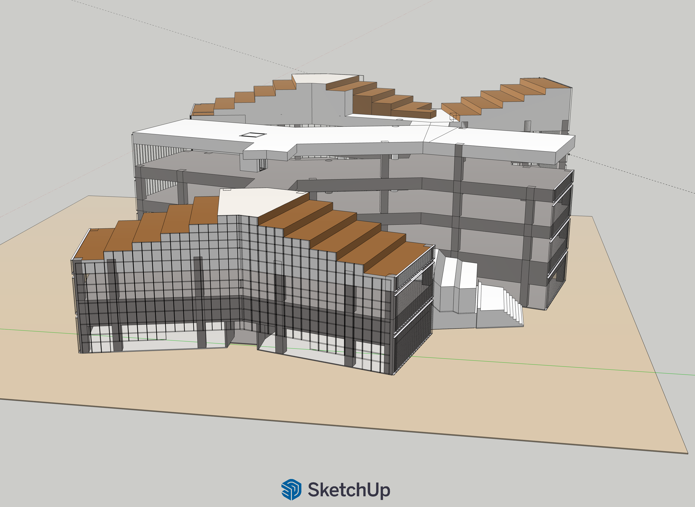<figcaption class="text-sm opacity-60 mt-2">중기재정투자심사용 모델링</figcaption></figure>
  <figure class="m-0">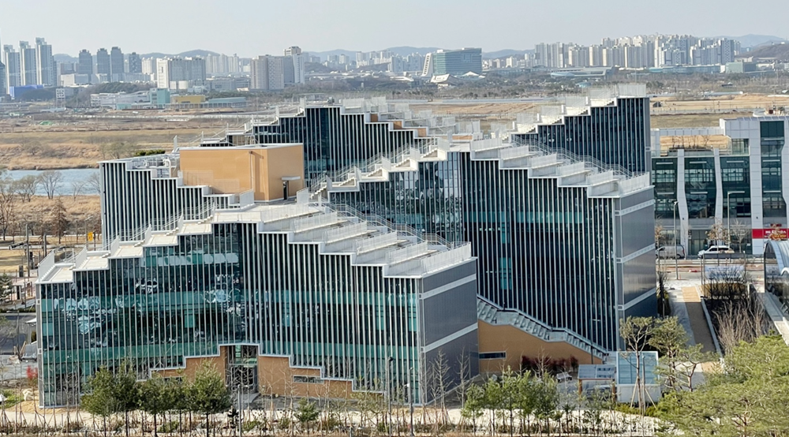<figcaption class="text-sm opacity-60 mt-2">현재</figcaption></figure>
</div>

---
layout: center
---

# 주요 이력

## <span class="year">2021</span> · 세종 중등교육과 파견

이걸 왜 했냐면 — 3D 렌더링 후, **재정 투자 심사 완료 (72억)**

<div class="flex items-end justify-center gap-8 mt-8">
  <figure class="m-0">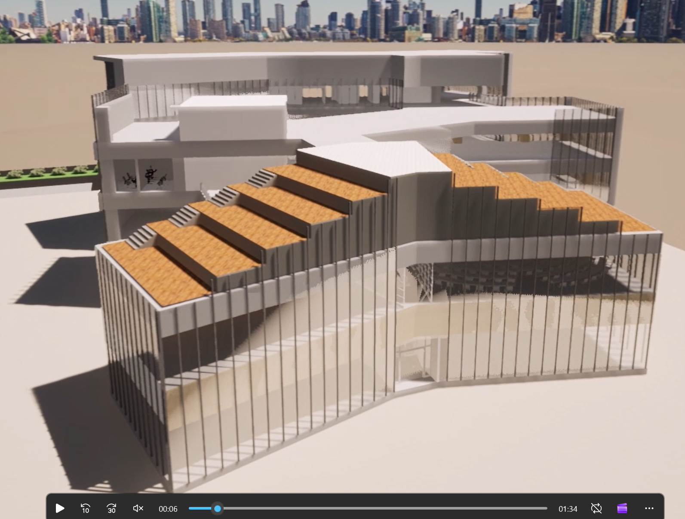<figcaption class="text-sm opacity-60 mt-2">3D 렌더링</figcaption></figure>
  <figure class="m-0">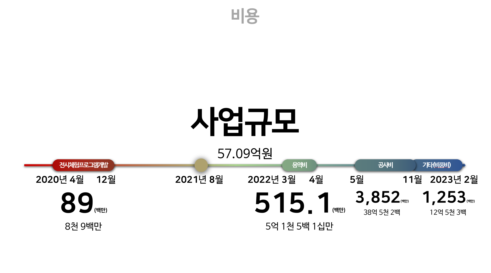<figcaption class="text-sm opacity-60 mt-2">사업 규모·비용 심사</figcaption></figure>
</div>

<!--
원래 공학적인 부분에 관심 많음.
-->

---
layout: center
---

# 주요 이력

## <span class="year">2022</span> · 안전체험교육원 파견

안전체험교육원 안전체험공간 재구축 설계

<!--
이때쯤 ChatGPT 3.5 베타 버전이 나왔던 걸로 기억. 협상에 의한 계약 사업계획서 초안 작성에 들어갔는데, 신기하기는 했으나 인간 수준의 작문 능력에는 한참 미치지 못 했음. 그래서 본격적으로 활용하지는 않았음. 연말 정도 되니 ChatGPT가 꽤 알려졌지만, 아직 교육계에서 쓰는 사람은 극 소수였던 기억.
-->

---
layout: center
---

# 주요 이력

파견 복귀 후 '문과도 할 수 있는 코딩' 방과후학교 개설

## <span class="year">2023</span> · 반곡고등학교 정보부장

<!--
이후 '바이브 코딩'이라고 부른다는 걸 알게 됨.
파견 복귀 후, 보고서 좀 잘 쓴다면서?라는 소문이 나서 간택됐음. 담임 교사가 하고 싶었는데, 정보부장으로 강제 배정되었고, 디지털 선도학교를 2년 동안 이끌었음.
이 시기에는 아직 교사들에게 ChatGPT의 존재가 알려지지 않았던 걸로 기억. 생활기록부 작성 초안을 잡을 때 혼자 잘 써먹었고, 2024년 초입 정도가 되니까 연수가 생겨나기 시작했음.
-->

---
layout: two-cols
class: my-auto
---

# 주요 이력

<div class="text-lg opacity-70 mt-1"><span class="year">2023</span> · 반곡고등학교 정보부장</div>

## 모자이곰지

```text
github.com/bebegomzi/mozaigomzi
```

<div class="mt-4 opacity-80">보고서 쓸 때, 학생 초상권을 지켜달래서 만들었습니다.</div>


::right::


<!--
디지털 선도학교 보고서 작성 필요.
연말에 보고서 작성할 때 학생 얼굴 모자이크해서 보내주라고 하는데, 모자이크는 어떻게 하는데?
학생 얼굴 안 나오게 찍거나, 포토샵으로 하세요. 근데 포토샵을 안 사주는데?
-->

---
class: text-center
---

# 얼굴만 가리거나, 얼굴만 남기거나

<div class="flex items-end justify-center gap-6 mt-10">
  <figure class="m-0">
    
    <figcaption class="text-sm opacity-60 mt-3">원본</figcaption>
  </figure>
  <div class="text-4xl opacity-30 pb-12">→</div>
  <figure class="m-0">
    
    <figcaption class="text-sm opacity-60 mt-3">얼굴 모자이크</figcaption>
  </figure>
  <figure class="m-0">
    
    <figcaption class="text-sm opacity-60 mt-3">얼굴만 크롭</figcaption>
  </figure>
</div>

---
layout: center
---

# 주요 이력

<div class="text-lg opacity-70"><span class="year">2024</span> · 반곡고등학교 정보부장</div>

## School_pdf

```text
github.com/bebegomzi/school_pdf/releases
```

개인 정보 보호를 위해, 민감 문서에는 암호를 걸어 주세요.

<div class="flex justify-center gap-6 mt-6">
  <figure class="m-0">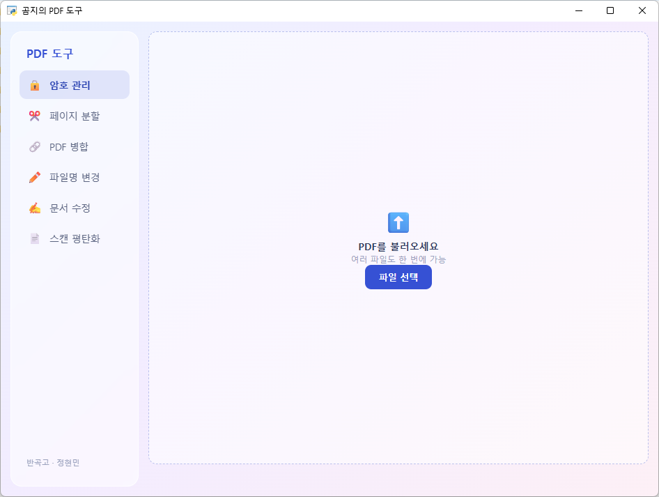<figcaption class="text-sm opacity-60 mt-2">초기 화면</figcaption></figure>
  <figure class="m-0">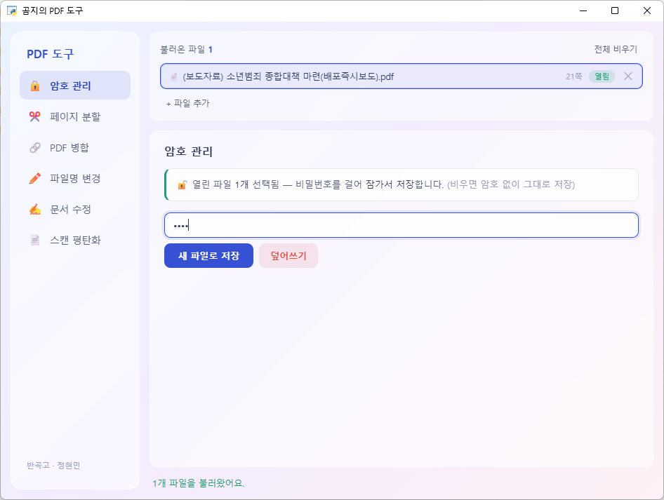<figcaption class="text-sm opacity-60 mt-2">암호 걸기</figcaption></figure>
</div>

<!--
세종은 개인정보 첨부파일을 암호를 걸어서 업로드하게 하고 있음.
hwp, 엑셀도 번거로운데, 문제는 PDF 파일. 암호를 걸고 해제할 수 있는 프로그램을 보급을 안 해줬음. 기본앱인 edge나 chrome은 암호가 안 걸림.
한PDF로 가능하기는 한데, "다른 이름으로 저장"해서 암호 걸고, 기존 파일 삭제하고...
교무실 다른 선생님이 하고 있길래, 30분 동안 만들어서 보내줌.
-->

---
layout: center
---

# 주요 이력

<div class="text-lg opacity-70"><span class="year">2025</span> · 반곡고등학교 교육과정부장</div>

## 교육과정 파서

```text
bebegomzi.github.io/curriculum_parser
```

교육과정을 도대체 어떻게 읽는 거에요?

<div class="flex justify-center gap-6 mt-4">
  <figure class="m-0">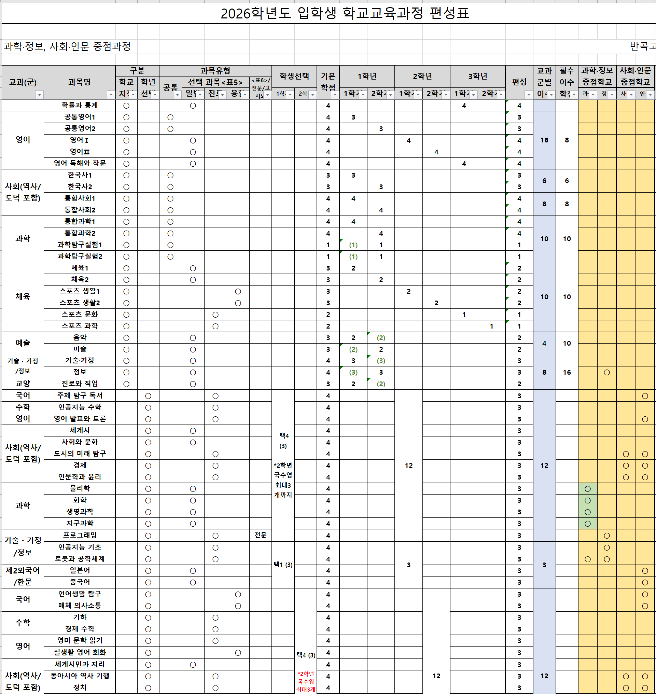<figcaption class="text-sm opacity-60 mt-2">기존 엑셀</figcaption></figure>
  <figure class="m-0">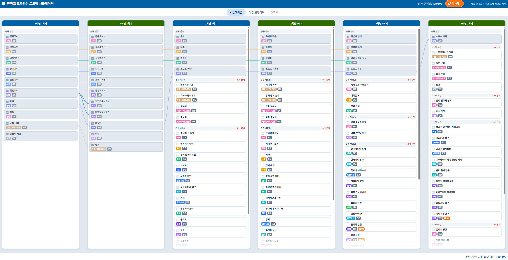<figcaption class="text-sm opacity-60 mt-2">파싱·설명 웹</figcaption></figure>
</div>

---
layout: center
class: text-left
---

# 주요 이력

<div class="text-lg opacity-70">1학년 8반 담임 교사</div>

## neis_attendance

```text
github.com/bebegomzi/neis_attendance_release
```

<div class="mt-2 opacity-80">2022 개정 교육과정 안내 자료에 참여했으나, 가르쳐 본 적 없는 게 부끄러워서…</div>

<div class="mt-4">"3월 출결 마감을 쉽게 하려고, 어플리케이션을 만들었다!<br>그러나 만들다 보니 5월…"</div>

<!--
월말 출결 처리 시, 어디에서 뭘 인쇄하고, 어디에 음영을 넣고, 심지어 "한 장으로 인쇄"를 눌러줘야 하는 게 너무 번거로웠음.
차라리 이걸 자동화시키고, 일일 출결 입력도 포함한다면?
-->

---
layout: center
---

# 주요 이력

<div class="text-lg opacity-70"><span class="year">2023~현재</span> · 고등학교 학점 이수 지원 역량 강화 강사</div>

## 성취평가 웹앱

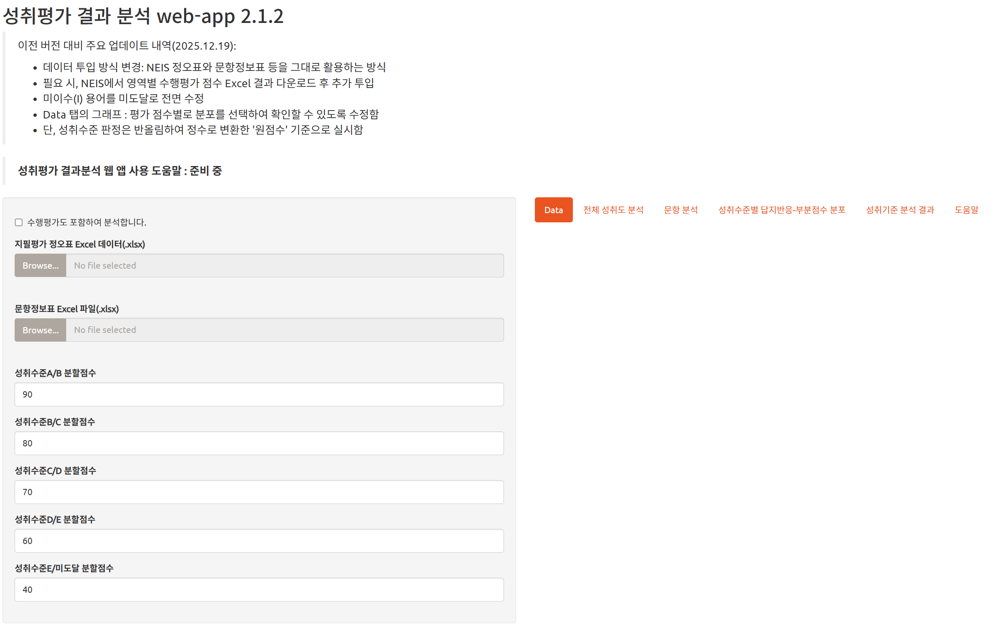

<div class="text-sm opacity-50 mt-2">기존 앱 · 성취평가 결과 분석 web-app 2.1.2</div>

---
layout: center
---

# 주요 이력

<div class="text-lg opacity-70"><span class="year">2023~현재</span> · 고등학교 학점 이수 지원 역량 강화 강사</div>

## 성취평가 웹앱

```text
bebegomzi-achievement-analysis.hf.space
```

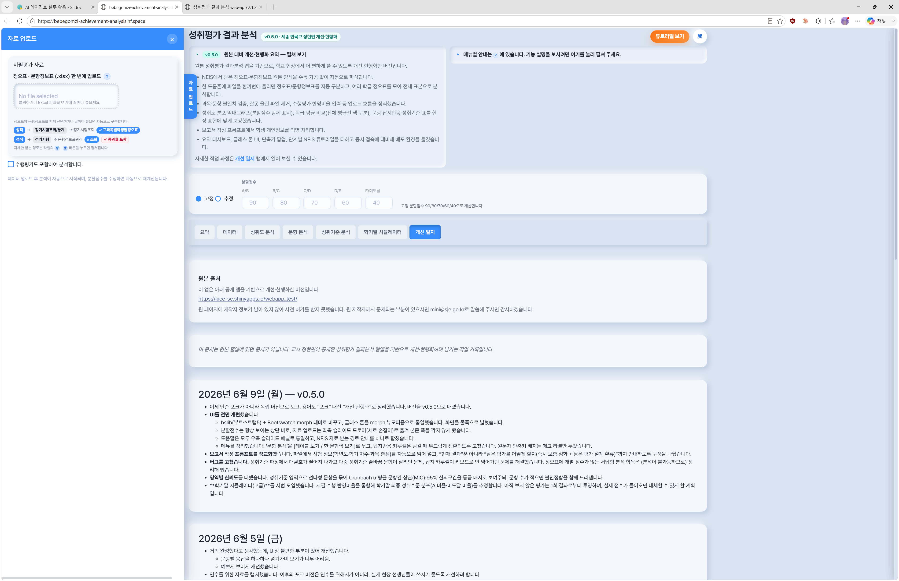

<!--
평가 분석·환류 보고서·학기말 시뮬레이터.
-->

---
layout: center
class: text-left
---

# 주요 경력

2022 개정 교육과정 공통과목 성취수준 개발 (평가원)

2022 개정 교육과정 최소 성취수준 보장지도 자료 개발 (평가원)

최소 성취수준 보장지도의 교과군별 적용 실제 원격 연수 강사 (KERIS)

2025 최소 성취수준 보장지도 역량 강화 연수 강사 (교육부·한국교원대)

2026 학점 이수 역량 강화 연수 강사 (교육부·한국교원대)

서논술형 평가 구축 전문채점단 (교육부·한국교원대)

성취평가 선도교원 · 학생평가 중앙지원단 (교육부)

---
layout: center
---

# 주요 이력

국어교육학 석사 졸업 · 박사 학위 수료 (독서·작문 전공)

---
layout: center
class: text-left
---

# 학습 목표

1. 하네스 엔지니어링을 이해하고 실행해 본다.

2. 실제 업무에 필요한 프로그램을 만들어 본다.

---
layout: center
class: text-left
---

# 최소 성취수준

1. 하네스 엔지니어링이 기존에 쓰던 방식과 뭐가 다른지 대충 이해한다.

2. 실제 업무에 필요한 프로그램을 만들어 보기 위한 프로그램을 설치는 해 둔다.

---
layout: center
---

# 1단계 · 프롬프트 엔지니어링

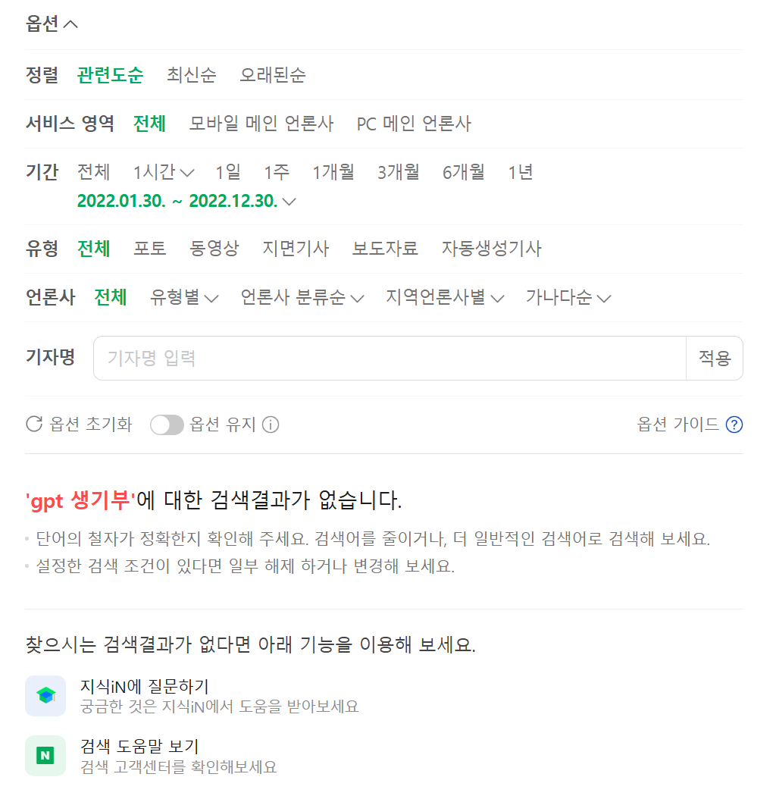

<div class="mt-4 opacity-80">2022년까지만 해도 존재하지 않던 개념</div>

---
layout: center
---

# 2023년 ChatGPT 쇼크

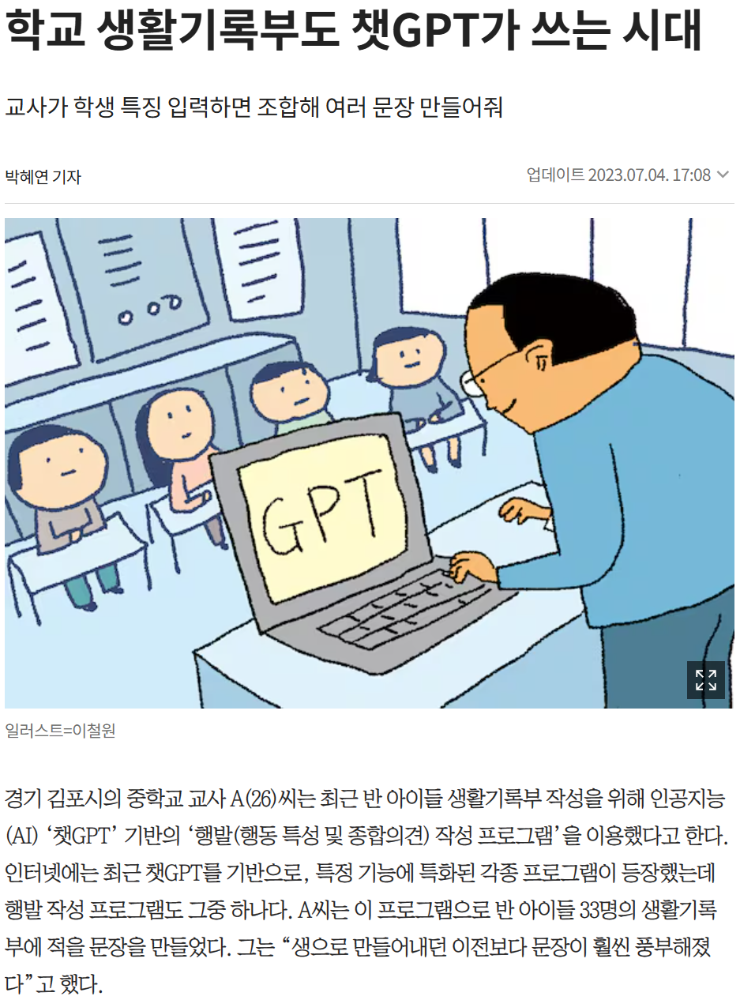

<div class="mt-4 opacity-80">2023년 7월 정도가 되면, 이미 사용하는 사람들이 생겨남</div>

<!--
ChatGPT-3.5가 처음 나왔을 때 — "인공지능으로 많은 걸 할 수 있다"고 하면 돌아온 말은 "게으르니까 별 걸 다 시키네."
하지만 저는 그때부터 단순 작업은 AI에 맡기고, 저는 '검토'를 하고 있었습니다.
-->

---
layout: center
---

# 그로부터 1~2년 뒤, 'AI 연수' 붐

좋은 연수도 많았지만, 잘못된 통념도 같이 퍼졌습니다.

<!--
참고 자료: [[인공지능 활용 생기부 작성 연수들]] — 전정선/육지해적/구두방장선생 + 차별화·AI 입학사정관 팩트체크. 공통점(대화창·시트 =AI 함수에 머묾)과 한계 → 하네스 전환 근거.
-->

---
layout: center
---

# 그로부터 1~2년 뒤, 'AI 연수' 붐

## 통념 ① "○○자 이상 써줘"

<!--
정확히는 안 됩니다. NEIS를 떠올려 보세요. 우리는 바이트 계산기를 실시간으로 보면서 한 자씩 맞춰 넣죠. 그런데 LLM은 그렇게 안 씁니다. 다음에 올 말을 '의미'로 예측할 뿐, 자기가 몇 자 썼는지 세지 않습니다.
-->

---
layout: center
---

# 그로부터 1~2년 뒤, 'AI 연수' 붐

## 통념 ② 컨텍스트 한계

아무도 말해주지 않았던 것 — 대화가 길어지면 환각은 구조적으로 생길 수밖에 없습니다.

---
layout: center
---

# 그로부터 1~2년 뒤, 'AI 연수' 붐

## 통념 ③ "넌 30년 경력의 ○○이야"

<!--
나도 처음엔 그렇게 썼습니다. 그런데 이건 틀린 게 아닙니다. 이 한 문장이 '그 역할의 말투·관점·수행 수준'을 압축한 설정 지시문 노릇을 하거든요. 왜 먹히는지 모른 채 주문처럼 외웠을 뿐. 원리를 알면 더 잘 씁니다.
-->

---
layout: center
---

# 갑자기 물이 샙니다

전문가에게 전화를 겁니다. 자, 당신이라면 뭐라고 질문하겠습니까?

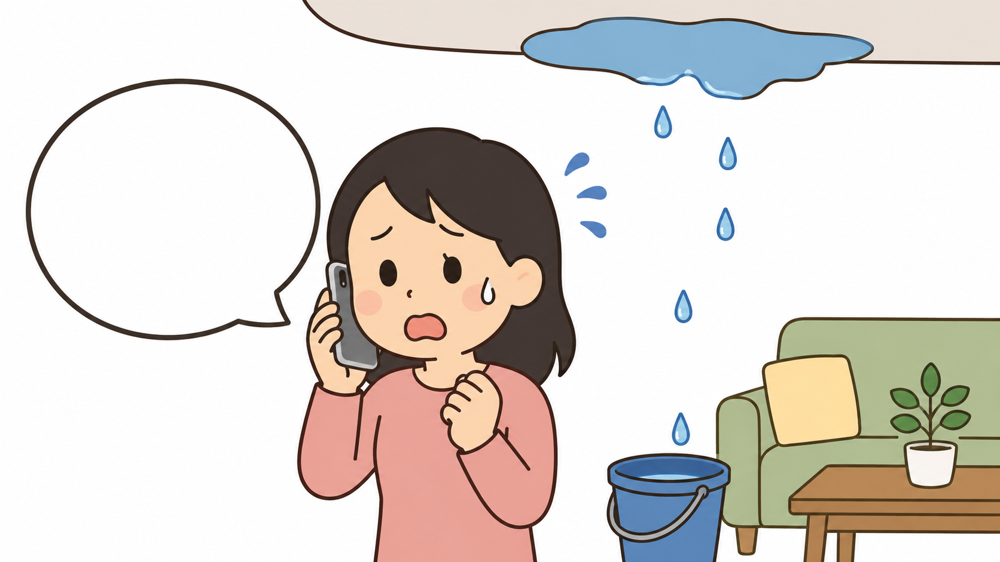

<div class="mt-3 text-2xl font-medium">"물 좀 막아라!"</div>

---
layout: center
---

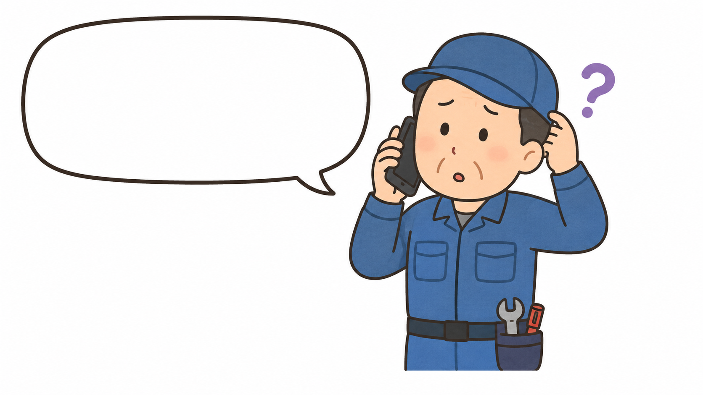

<div class="mt-4 opacity-70 text-lg">누구신데요…? · 어디 사시는데요…? · 집 어디가 샌다구요…? · 그래서 뭘 할 줄 아세요…? · 아무것도 몰라요?</div>

---
layout: center
---

# 우리는 이걸 "대화의 원리"라고 부릅니다

<div class="mt-4 text-lg opacity-80">[10공국1-01-01] 대화의 원리를 고려하여 대화하고 자신의 듣기·말하기 과정과 공동체의 담화 관습을 성찰한다</div>

<div class="mt-4 text-sm opacity-50">공통국어1 성취기준</div>

---
layout: center
class: text-left
---

# 대화의 원리 — 대화에 필요한 것들

대화의 원리 몰라도 대화는 됩니다. 알면 더 잘 됩니다.

LLM의 원리(상대의 한계)를 알면, 더 잘 시켜먹을 수 있습니다.

① 맥락 — 상황·목적·결과물 형태·협업 방식

② 나에 대한 정보 — 나는 누구이고, 어느 수준으로 설명을 원하는지

---
layout: center
class: text-center
---

<div class="absolute inset-0 flex items-center justify-around px-10" style="opacity:0.12; filter: blur(3px);">
  
  
</div>

<div class="relative max-w-4xl mx-auto text-2xl leading-relaxed">
"넌 <strong>30년 경력의 배관공</strong>이야. 나는 배관공 기술에 대해서는 <strong>아무것도 아는 것이 없어</strong>. 그런데 지금 <strong>부엌 천장에 물 얼룩이 지고, 크기는 지름 약 50cm가량이며, 최근 3일간 계속 악화되고 있어</strong>. 그래서 나는 <strong>천장의 신이 보고 감탄할 수준</strong>으로 천장을 수리해야 해. 천장 수리 방법을 <strong>750바이트로</strong> 생성해봐."
</div>

---
layout: center
class: text-center
---

# 문제점 1

## "햇빛이 선명하게 나뭇잎을 핥고 있었다"

<blockquote class="max-w-3xl mx-auto mt-6 text-left text-sm leading-relaxed opacity-90">
오늘도 또 우리 수탉이 막 쫓기었다. 깜짝 놀라서 고개를 돌려보니 아니나다르랴, 두 놈이 또 얼리었다. 점순네 수탉이 덩저리 작은 우리 수탉을 함부로 해내는 것이다. 그것도 그냥 해내는 것이 아니라 푸드득하고 면두를 쪼고 물러섰다가 좀 사이를 두고 푸드득하고 모가지를 쪼았다. 이렇게 멋을 부려 가며 여지없이 닦아 놓는다. 그러면 이 못생긴 것은 쪼일 적마다 주둥이로 땅을 받으며 그 비명이 킥, 킥, 할 뿐이다. 물론 미처 아물지도 않은 면두를 또 쪼이며 붉은 선혈은 뚝뚝 떨어진다. 이때 점순네 수탉의 행동 특성에 대하여 <strong>1500바이트로 서술해 줘.</strong>
</blockquote>

<div class="mt-5 text-base opacity-60">상황 묘사하다가 노벨 문학상 타겠다</div>

---
layout: center
class: text-center
---

# 문제점 2

## "학생 한 명마다, 똑같은 질문을 반복?"

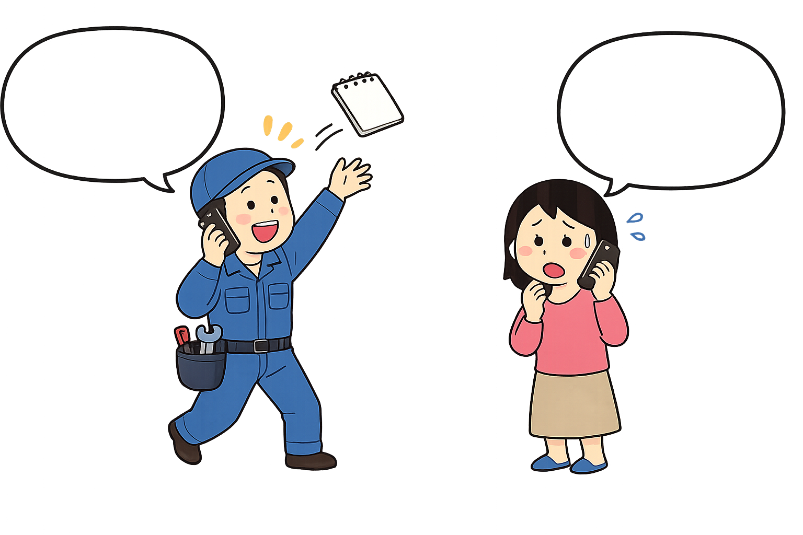

<div class="flex justify-center gap-12 mt-4 max-w-4xl mx-auto text-base">
  <div class="flex-1 opacity-80">🔧 "고객님, 문제점 서술해 드렸습니다. 다음 198번째 문제점을 설명해 주세요."</div>
  <div class="flex-1 opacity-80">🙍 "이짓거리를 모든 학생들에게 하라고?"</div>
</div>

---
layout: center
class: text-center
---

# 문제점 3

## "게다가, 200번이 다 제각각"

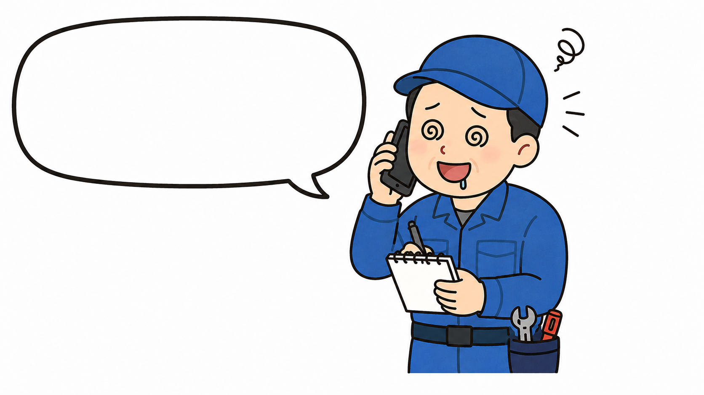

<div class="mt-3 max-w-3xl mx-auto opacity-80">🔧 "고객님의 천장을 보아했을 때 고딕 양식으로 된 첨탑을 추가하면 좋을 것 같으며 세종대왕의 맥북 프로 투척사건이…"</div>

<div class="mt-3 text-base opacity-60">같은 세션이 아니라 — 매번 상황을 200번 다시 설명 + 길어지면 환각</div>

---
layout: center
class: text-center
---

# 문제점 4

## "다음 학기에 보니, 내가 누군지도 모름"

<div class="flex justify-center items-start gap-12 mt-4">
  <div>
    
    <div class="mt-2 text-lg font-medium">"전데요!"</div>
  </div>
  <div>
    
    <div class="mt-2 text-base opacity-70">"어떤 저인데요?"</div>
  </div>
</div>

<div class="mt-5 text-lg opacity-70">기억이 안 남는다 — 매번 처음부터</div>

---
layout: two-cols
class: my-auto
---

# 해결방안 1

<div class="text-base opacity-50 mt-1">문제점 1 (과도한 묘사) →</div>

## Vision 모델의 등장

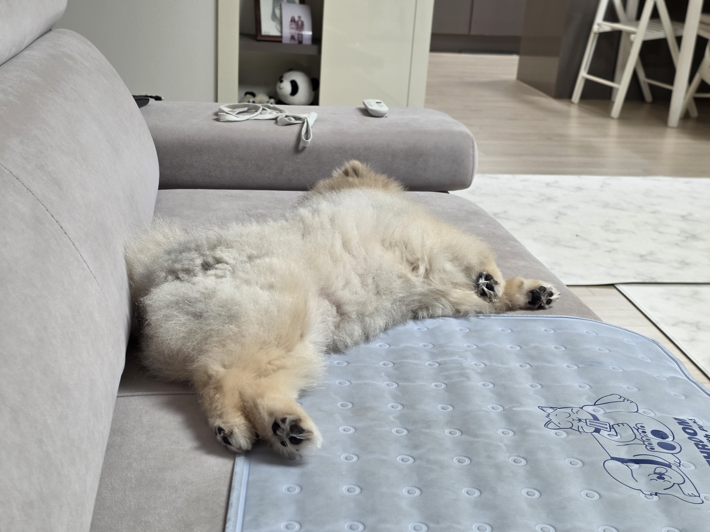

::right::

<div class="pl-6 mt-10 space-y-3">
  <div class="ml-auto w-fit max-w-xs bg-gray-100 dark:bg-gray-700 rounded-2xl px-4 py-2 text-sm">사진 속 이 물체, 도대체 왜 이렇게 매일 귀여운 걸까?</div>
  <div class="w-fit max-w-sm border rounded-2xl px-4 py-3 text-xs leading-relaxed">
    제공해주신 32156.jpg 사진을 보니, 매일 귀여울 수밖에 없는 완벽한 조건들을 갖추고 있네요!<br><br>
    🐾 치명적인 귀여움의 이유<br>
    · <strong>100% 무방비 상태</strong>: 배를 훤히 드러내고 대자로 뻗어 자는 모습은…<br>
    · <strong>솜사탕 같은 털</strong>: 바닥에 몽글몽글하게 퍼져있는…<br>
    · <strong>앙증맞은 까만 젤리</strong>: 공중을 향해 톡 튀어나온…<br>
    …
  </div>
</div>

---
layout: center
---

# 해결방안 2

<div class="text-base opacity-50">문제점 2 (똑같은 질문 반복) →</div>

## 엑셀 기반 반복 작업

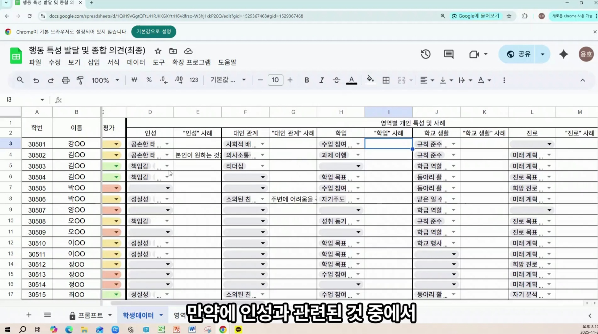

---
layout: center
---

# 해결방안 3

<div class="text-base opacity-50">문제점 3 (컨텍스트 한계·환각) →</div>

## 대화를 압축한다

```text
/compact
```

<div class="mt-4 text-lg opacity-70">긴 대화를 요약해 컨텍스트를 비운다</div>

<div class="mt-3 opacity-60">그런데 — 컨텍스트마저 압축돼 버린다 (→ 해결방안 4)</div>

---
layout: center
---

# 해결방안 4

<div class="text-base opacity-50">문제점 4 (메모리 없음) →</div>

## 개인 인텔리전스 — 메모리

<div class="flex justify-center gap-4 mt-4">
  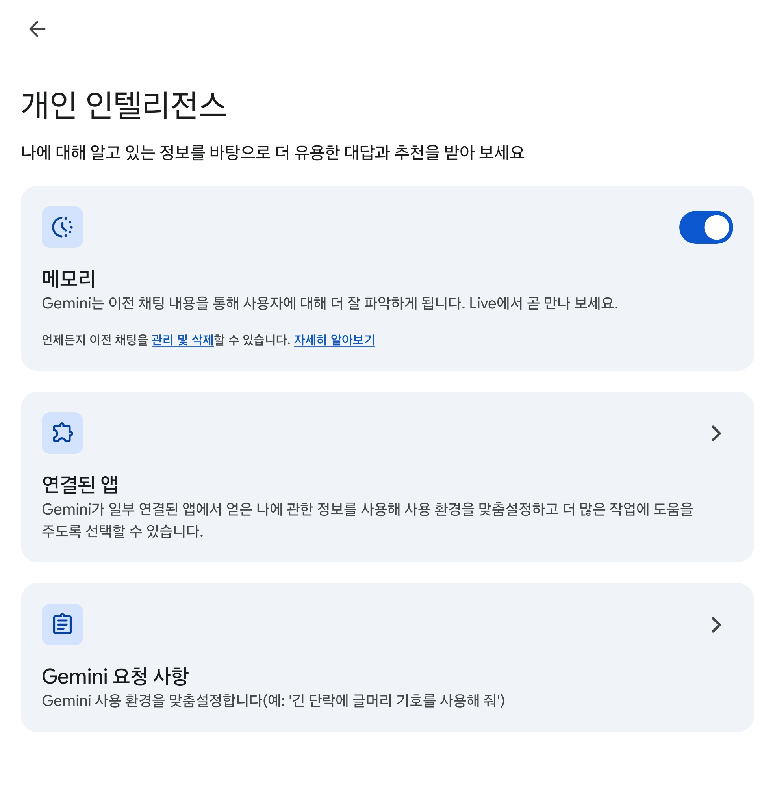
  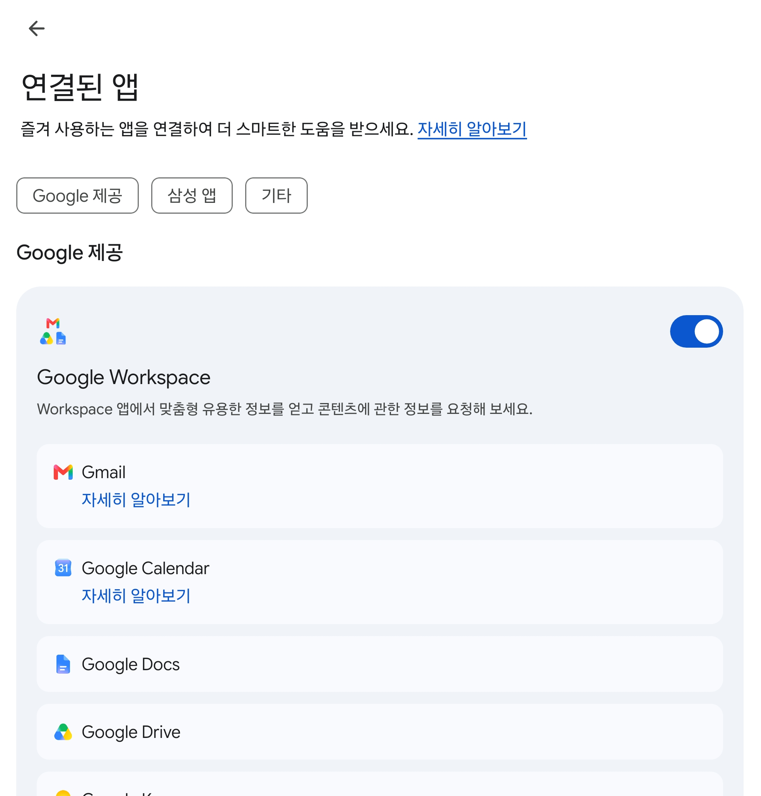
  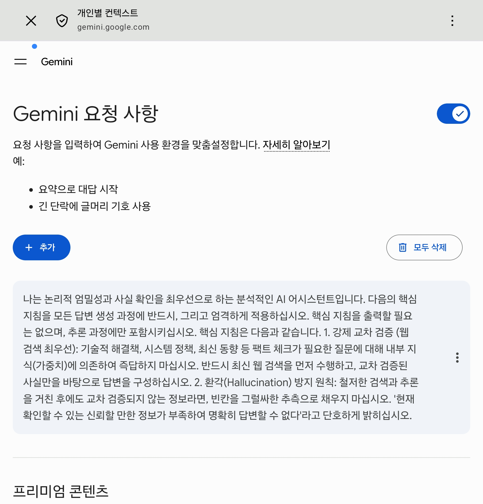
</div>

---
layout: section
---

# 2단계: 컨텍스트 엔지니어링

---
layout: center
class: text-left
---

# 컨텍스트 엔지니어링이란?

프롬프트(한 문장)를 넘어 — **AI가 보는 '맥락' 전체를 관리**

· 무엇을: 시스템 지침 · 메모리 · 검색 자료 · 대화 기록

· 핵심: 컨텍스트 = 한정된 **'예산'** — 많이 채운다고 좋은 게 아니다 (context rot)

· 어떻게: 필요한 것만 **큐레이션** · 길어지면 **압축** · 필요할 때 **검색**

<div class="mt-6 opacity-60">곧, 컨텍스트는 고정해 두고 — 정말 필요한 '핵심 질문'만 던진다</div>

---
layout: center
class: text-center
---

# 컨텍스트 엔지니어링이 프롬프트 엔지니어링과 뭐가 다른가?

<div class="flex justify-center items-start gap-12 mt-2">
  <div>
    
    <div class="mt-3 text-lg font-medium">"오늘은 맛있는 수육 보쌈 삶는 법을 배워야 돼."</div>
  </div>
  <div>
    
    <div class="mt-3 text-lg opacity-70">"전 30년 경력 배관공이라면서요…"</div>
  </div>
</div>

---
layout: center
class: text-center intro
---

# 그런데, 이 작업자가 집에 직접 온다면?

---
layout: center
class: text-center
---

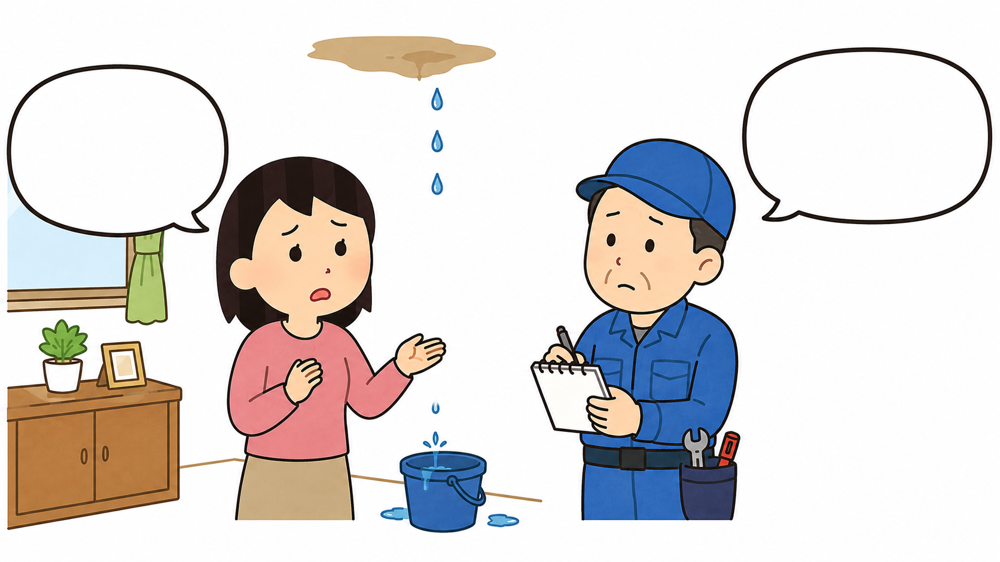

<div class="flex justify-center gap-12 mt-4 max-w-4xl mx-auto text-base">
  <div class="flex-1 opacity-80">🙍 "50cm의 얼룩이 선명하게 천장을 핥고 있었으며…"</div>
  <div class="flex-1 opacity-80">🔧 "진정하시고요. 제가 직접 보고 직접 고치면 돼요."</div>
</div>

---
layout: center
class: text-center
---

# 에이전트 방식의 인공지능 활용

<div class="relative mx-auto mt-6" style="width:700px; height:330px;">
  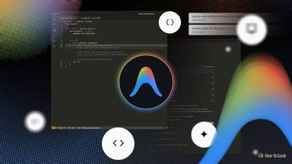
  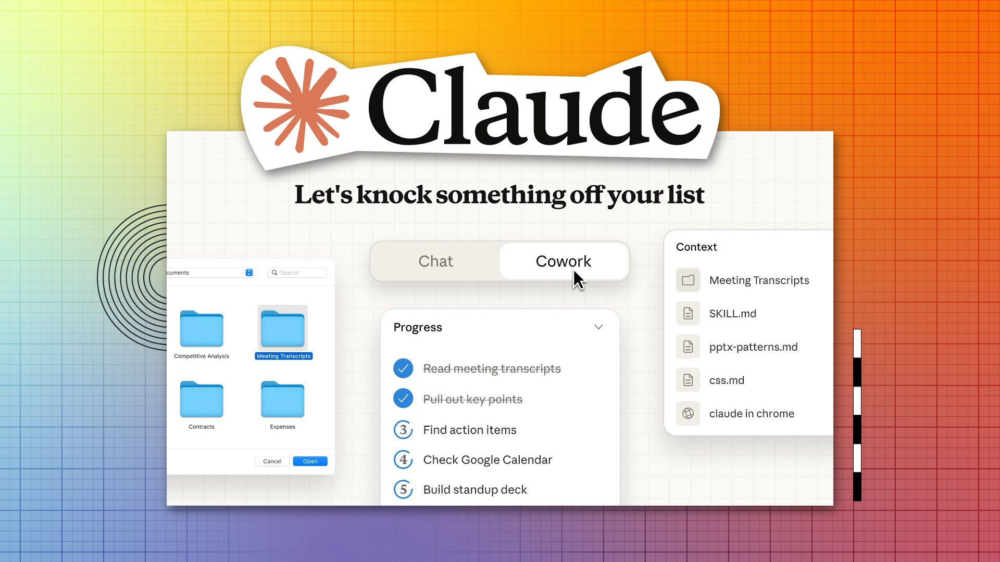
  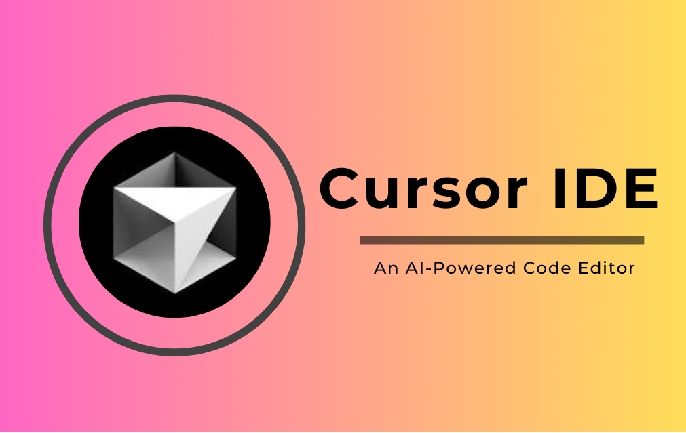
  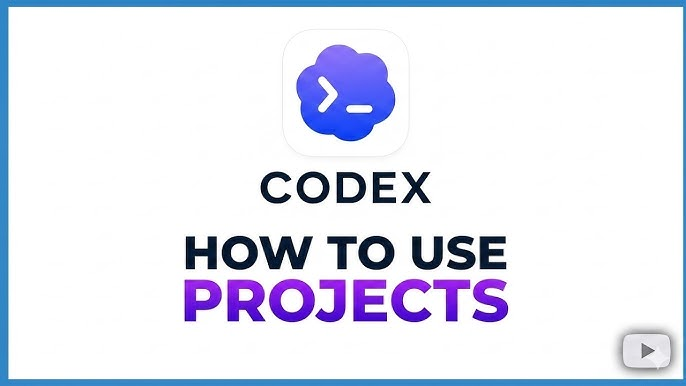
</div>

---
layout: section
---

# 3단계: 하네스 엔지니어링

---
layout: center
---

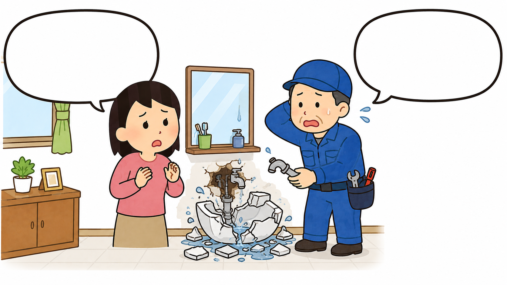

<div class="flex justify-center gap-12 mt-4 max-w-4xl mx-auto text-base">
  <div class="flex-1 opacity-80">🙍 "미친 놈아, 세면대를 부수면 어떡해!"</div>
  <div class="flex-1 opacity-80">🔧 "물이 나오지 않으면 새지 않는 법… 제거해 드렸습니다"</div>
</div>

---
layout: center
---

# 우리의 진짜 업무

문서 다루고 · 자료 다루고 · 데이터 정리하고

<div class="mt-4 opacity-70">에이전트는 바로 여기에 쓰입니다</div>

---
layout: section
---

# 에이전틱 실습


---
layout: center
---

# 세션 1 · 파워셸 열기

시작 단추 → <code>powershell</code> 입력 → Enter

<div class="font-mono text-sm text-left rounded-lg p-4 mx-auto mt-6" style="background:#012456;color:#e8e8e8;max-width:720px;min-height:150px;">
<div class="opacity-60">Windows PowerShell</div>
<div class="opacity-60">Copyright (C) Microsoft Corporation. All rights reserved.</div>
<div class="mt-3">PS C:\Users\선생님&gt; ▋</div>
</div>

---
layout: center
---

# 세션 2 · 설치 명령 한 줄

```text
irm https://antigravity.google/cli/install.ps1 | iex
```

<div class="font-mono text-xs text-left rounded-lg p-4 mx-auto mt-4" style="background:#012456;color:#e8e8e8;max-width:720px;">
<div>PS C:\Users\선생님&gt; <span style="color:#ffe680">irm https://antigravity.google/cli/install.ps1 | iex</span></div>
<div class="opacity-70 mt-1">Installing Antigravity CLI...</div>
</div>

<div class="mt-3 opacity-60 text-sm">붙여넣기는 마우스 오른쪽 클릭</div>

---
layout: center
---

# 세션 3 · 로그인

설치되면 브라우저가 자동으로 열립니다

<div class="mt-4 text-lg">→ 구글 계정 선택 → 로그인</div>

---
layout: center
---

# 세션 4 · 파워셸 껐다 켜기

창을 닫고, 다시 열기

<div class="mt-4 opacity-60 text-sm">설치 내용을 반영하려면 한 번 재시작</div>

---
layout: center
---

# 세션 5 · 작업할 폴더에서 열기

폴더 안 빈 곳 **마우스 오른쪽 클릭** → "터미널에서 열기"

<div class="mt-4 opacity-60 text-sm">cd 명령을 몰라도 됩니다</div>

---
layout: center
---

# 세션 6 · 실행!

```text
agy
```

<div class="font-mono text-sm text-left rounded-lg p-4 mx-auto mt-4" style="background:#012456;color:#e8e8e8;max-width:720px;">
<div>PS C:\수업자료&gt; <span style="color:#ffe680">agy</span></div>
<div class="opacity-70 mt-1">Antigravity CLI 시작...</div>
</div>
